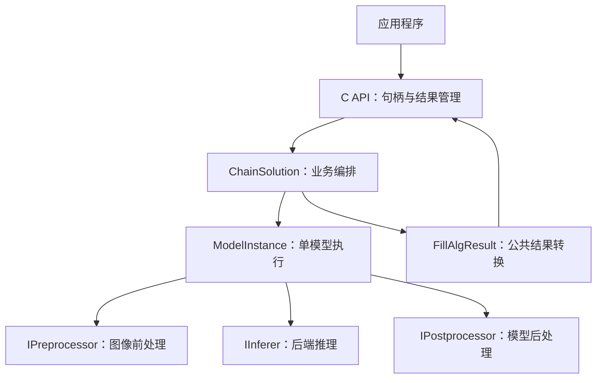

# alg_sdk 架构设计

alg_sdk 按公共接口、业务编排、模型执行和芯片适配分层。设计目标是集中维护公共接入流程，将平台差异限制在后端实现中，并通过配置复用已有模型和处理流程。

## 1. 设计目标与边界

| 目标 | 实现方式 | 适用边界 |
|------|----------|----------|
| 减少平台移植的重复开发 | 通过 `IInferer` 封装模型加载、推理和芯片内存管理 | 新后端仍需适配工具链、依赖库和模型文件 |
| 复用模型执行流程 | `ModelInstance` 组合前处理、推理和后处理 | 新输出格式需实现后处理；特殊输入可能需扩展前处理 |
| 配置业务组合 | JSON 描述模型实例、阶段顺序、裁剪和结果写回 | 仅覆盖已实现的阶段语义与公共结果类型 |
| 集中维护参数 | 配置阈值、裁剪范围、颜色转换和归一化 | 参数须符合模型约定，修改配置后重建实例 |
| 控制推理中的内存开销 | 复用张量、AIPP 原图 staging、临时图像缓冲和内联公共结果 | 颜色转换和越界填充仍可能分配或复制内存 |
| 稳定应用接入方式 | 使用不透明句柄与强类型 C 结果 | 公共结构体变化需要同步更新调用方 |

本版本对外提供限速牌、禁令 / 停车牌和车牌结果。红绿灯检测保留内部处理能力，公共结果转换不输出红绿灯对象。关键点和分割字段保留在内部对象中，未纳入公共 C ABI。

## 2. 模块分层

| 模块 | 位置 | 职责 |
|------|------|------|
| 公共接口 | `include/`、`src/interface/` | 句柄、状态码、输入图像及结果所有权 |
| 配置解析 | `src/core/config/` | JSON 解析、模型引用与阶段引用校验 |
| 业务编排 | `src/core/solution/` | 顺序执行阶段、ROI 裁剪、结果写回与过滤 |
| 模型实例 | `src/core/instance/` | 组合单模型的前处理、推理和后处理 |
| 前处理 | `src/core/preprocess/` | 颜色转换、缩放、填充、归一化和张量写入 |
| 后端适配 | `src/backend/` | 封装 XMM、SVP ACL、MNN；保留 RK 桩实现 |
| 后处理与注册 | `src/models/`、`src/core/registry/` | 按模型类型解析输出并创建处理器 |
| 公共结果转换 | `src/core/object.cpp` | 将内部对象映射为强类型数组 |
| 日志 | `src/core/log/` | 日志级别、异步输出与文件管理 |

业务配置和模型分别位于 `resources/config/<backend>/`、`resources/model/<backend>/`。平台构建配置位于 `cmake/`，交叉编译工具链位于 `toolchain/`。

## 3. 核心接口

### 3.1 TensorView

[TensorView](src/core/tensor.h) 描述张量，不拥有底层内存。后端负责分配和释放缓冲，前处理和后处理通过该描述访问数据。

| 字段 | 含义 |
|------|------|
| `name` | 张量名称，供输出头匹配使用 |
| `dtype` | 数据类型，包括 U8、I8、U16、I16、F16、F32 和 I32 |
| `layout` | 张量布局：NCHW、NHWC 或 ND |
| `shape` | 维数和各维尺寸 |
| `quant` | 量化标识、比例及零点 |
| `data` | 宿主可访问的数据地址 |
| `size_bytes` | 缓冲字节数 |
| `row_stride` | 非紧凑张量的实际行字节跨度；0 表示紧凑存储 |

描述符支持的类型和布局不等同于所有处理器均支持这些组合。例如通用前处理仅输出 NCHW，支持 UINT8 和 FLOAT32；后处理器按自身实现读取模型输出。

采用非拥有式描述符后，核心模块不依赖芯片专用分配器。其约束是数据访问必须处于后端缓冲的有效生命周期内；输出视图的只读接口不能代替生命周期管理。

### 3.2 IInferer

[IInferer](src/core/infer/inferer.h) 提供模型加载和执行接口：

| 方法 | 职责 |
|------|------|
| `Load(model_path)` | 加载模型，准备输入输出及相关缓冲，填充张量视图 |
| `Forward()` | 执行推理，并按后端要求完成缓存同步或数据复制 |
| `NumInputs()` / `NumOutputs()` | 返回业务输入输出数量 |
| `InputView(i)` | 返回可写输入视图 |
| `OutputView(i)` | 返回供后处理读取的输出视图 |

XMM 后端封装 xmedia_cl 与 MMZ 管理，SVP ACL 后端管理模型及辅助缓冲，MNN 后端提供本地执行。`MakeInferer()` 和 `BackendName()` 由构建配置选入对应实现，一份动态库使用一个后端。

### 3.3 IPreprocessor

[LetterboxPreprocessor](src/core/preprocess/letterbox_preprocessor.cpp) 实现通用前处理。`Configure` 检查网络尺寸、布局和数据类型，`Apply` 将图像写入模型输入并返回 `PreprocessState`，记录缩放比例、填充偏移和模型本次输入图像的尺寸。

海思动态 AIPP 模型通过 `AlgRun` 接收原分辨率 VPSS NV12/NV21 帧。连续的非 cached MMZ/VB 映射直接绑定到 ACL data buffer，不复制、不 flush；分平面输入由 libyuv 按原尺寸合并到 ACL staging。两种输入均由 AIPP 完成 CSC 和缩放。`ChainSolution` 在分平面源和 staging 布局一致时复用同一 ACL 缓冲，一帧只复制并 flush 一次。普通 OM 使用通用 OpenCV 前处理。CV610 AIPP 无法生成值为 114 的大范围 padding，因此检测 OM 在图首用常量 `Pad` 补齐 AIPP 输出；配置和运行时共同校验有效区及补边布局。默认格式是 NV21，运行时同时支持 NV12。

支持 `stretch`、`letterbox_tl`、`letterbox_tl_fit` 和 `letterbox_center`。UINT8 输入直接写入像素，FLOAT32 的有效图像区域可按 `(x-mean)*scale/std` 归一化；FLOAT32 填充区域直接使用 `pad_value`。

BGR、RGB 和 GRAY 使用图像行跨度。NV12/NV21 支持连续缓冲，也支持 Y 与 UV/VU 分别传入且各自使用独立 stride；`image_view.h` 将两种公共表示解析为统一平面视图。通用路径先缩放 Y 和色度平面再转换颜色，需要二阶段裁剪时只转换原始 YUV 的局部区域。固定 ROI 和裁剪后的结果通过偏移恢复原图坐标。

统一配置覆盖现有模型的前处理组合。涉及多图拼接、复合输入等不同处理需求时，可通过 `IPreprocessor` 扩展，避免在既有实现中混入无关模型逻辑。

### 3.4 IPostprocessor 与注册表

[IPostprocessor](src/core/postprocess/postprocessor.h) 的 `Configure` 读取后处理参数并检查输出张量，`Apply` 生成 `std::vector<Object>`，供编排层继续处理。

检测框先从网络坐标恢复到本次模型输入图像的坐标；模型输入若来自裁剪，编排层再恢复到原帧坐标。分类结果写回时保留上游检测框，采用分类分和业务属性更新对象。

| 注册名 | 用途 |
|--------|------|
| `yolox_det` | 多尺度 YOLOX 检测，保留红绿灯内部流程 |
| `yolov5_anchor_det` | SpeedSignNet 单尺度锚框检测，分数为 `sigmoid(obj) × softmax(cls)` |
| `ocr_classifier` | 逐位 OCR、门控分类及数字组合过滤 |
| `dualhead_classifier` | 双头分类模型兼容处理 |
| `rtmdet_det` | RTMDet 车牌检测 |
| `lprnet_rec` | LPRNet CTC 车牌识别 |

处理器通过 `REGISTER_ALG_POST` 注册。`ModelInstance` 使用 `postprocess.type` 创建实例，类型未注册时返回 `ALG_E_MODEL_NOT_FOUND`。注册宏使用 `__attribute__((used))` 标记静态注册对象；新增类型仍须将实现和注册源文件加入构建，并检查 Release 产物能否创建该类型。

### 3.5 ModelInstance

[ModelInstance](src/core/instance/model_instance.cpp) 管理单个模型的执行单元，持有后端、前处理和后处理实例。

初始化顺序为创建后端、加载模型、配置前处理、创建并配置后处理。执行顺序为前处理、推理、后处理，任一步返回错误时停止本次执行并向上层返回状态。

启用 Info 日志后，模型实例记录前处理、推理及后处理耗时，用于区分不同阶段的性能开销。

### 3.6 ChainSolution

[ChainSolution](src/core/solution/chain_solution.cpp) 在初始化时创建全部模型，解析阶段引用，并确定是否需要共享原图转换结果。执行时按 `stages` 顺序处理，各业务分支在同一次调用中顺序运行。

| 输入与输出组合 | 处理规则 |
|----------------|----------|
| `image` → `objects` | 对原图或固定 ROI 执行模型，建立阶段对象集合 |
| `objects_from:s` → `objects` | 对上游框逐个裁剪并执行检测，生成新对象 |
| `objects_from:s` → `classify_into:s` | 将首个识别结果写回上游框，更新类别、业务值、属性及联合分；无识别结果则丢弃该框 |
| `objects_from:s` → `attributes_into:s` | 用首个子结果替换上游属性，不进行分类分相乘 |
| `objects_from:s` → `keypoints_into:s` / `mask_into:s` | 写回内部预留字段，不产生对应公共输出 |

输入和写回目标应使用同一上游 stage；实现修改的是输入 stage 的对象。最终仅收集 `produces="objects"` 的阶段结果，并跳过 `drop=true` 的对象。

`passthrough` 根据上游 label 标注业务类别，跳过子模型；PARE 采用该路径保留检测分。`score_threshold` 过滤识别写回后的联合分，不作用于透传路径。`min_box_short` 按类别检查原图框短边。

### 3.7 内部对象与公共结果

[Object](src/core/object.h) 使用 `field_mask` 标记内部字段是否有效，并存放检测框、分类索引、业务值、属性和过滤标志。内部关键点、掩码字段不属于公共接口。

[FillAlgResult](src/core/object.cpp) 按 `category` 转换具有检测框和属性的对象：

| `category` | 公共结果 | 值的来源 |
|------------|----------|----------|
| `speed_limit` | `AlgSpeedLimit[]` | `Object.value`，有效值为 `SLV_10`～`SLV_120` |
| `no_parking` / `pare` | `AlgSign[]` | 根据类别名称确定牌种 |
| `license_plate` | `AlgLicensePlate[]` | `text` 与 `rec_score` 属性 |
| `traffic_light` | 不输出 | 保留内部检测能力 |

公共 `AlgResult` 使用三个独立的强类型数组，应用无需访问内部属性或 `field_mask`。车牌文本最多输出 31 字节并以空字符结束；空文本候选由识别后处理丢弃，应用仍应另行判断业务有效性。

## 4. 执行流程与资源管理

以限速牌流程为例：

1. `AlgCreate` 读取配置并初始化模型实例。
2. `AlgRun` 检查顶层指针，清空固定容量结果的有效数量。
3. 检测阶段完成图像前处理、模型推理、检测解码和 NMS。
4. 识别阶段对 PARE 执行透传，对其他候选框裁剪后执行门控与 OCR。
5. 识别结果写回检测框，并执行联合分及最小框过滤。
6. 汇总有效对象，填充公共内联数组，设置成功调用帧号。
7. 应用消费结果，结束时调用 `AlgDestroy`。

| 资源 | 持有方 | 释放或复用时机 |
|------|--------|----------------|
| 原始像素 | 应用 | `AlgRun` 返回后可复用 |
| 模型和后端缓冲 | 后端实例 | 实例销毁时释放 |
| 前处理临时图像 | 前处理实例 | 同尺寸时复用，实例销毁时释放 |
| 裁剪图像 | 编排执行过程 | 视图或临时图像按裁剪路径管理 |
| 阶段对象集合 | `ChainSolution` | 各帧复用容量，执行过程中更新内容 |
| 公共结果数组 | `AlgResult` 内联持有 | 固定容量为限速牌 5、禁令牌 5、车牌 2；随结构体生命周期结束 |

建议将结果结构零初始化并放在栈上；结构体复制会完整复制所有结果数组。

`frame_id` 为动态库内共享的成功调用计数，从 0 开始，包括成功但无目标的帧。推理实例与该非原子计数器未提供并发保证，应用应串行调用 SDK。

## 5. 配置约束

配置包含非空 `models` 和 `solution.stages`，`solution.type` 仅支持 `chain`。阶段模型引用必须存在；上游输入和写回引用必须指向此前的阶段；固定 `roi` 仅用于 `input="image"`。

模型尺寸、输入类型和颜色约定须与配置一致。模型路径按进程工作目录解析，不以 JSON 文件所在目录为基准。全部模型在创建时初始化，包括未被 stage 引用的模型。

配置字段、默认值及示例见 [配置说明](resources/CONFIG.md)。不同后端的组合业务以各自的 [配置目录](resources/config) 为准。

## 6. 扩展与维护

### 6.1 新增后端

1. 在 `src/backend/<chip>/` 实现 `IInferer`，提供模型加载、推理和资源释放。
2. 实现 `MakeInferer()` 和 `BackendName()`。
3. 配置工具链、后端源文件、头文件及链接依赖。
4. 准备匹配的模型和业务配置，验证模型加载、结果一致性、连续运行和资源释放。

对模型输入输出约定一致的情况，前后处理和公共接口可以复用；数据布局或输出格式不同的情况需同步适配相关模块。

### 6.2 新增模型类型

1. 在 `src/models/<type>/` 实现 `IPostprocessor`，输出内部对象及有效字段标志。
2. 添加注册源文件，并加入 CMake 的 `ALG_MODEL_SRCS`。
3. 在模型配置中指定新的 `postprocess.type` 和参数。
4. 验证输出张量布局、量化参数、坐标恢复及结果类别映射。

如果模型产生新的公共业务结果，应一并扩展 `alg_types.h`、`FillAlgResult`、示例程序和接口文档。

### 6.3 调整业务流程

使用已注册模型和已实现阶段语义时，可通过 JSON 调整模型组合、阈值和裁剪方式。调整后重建实例，并以对应设备和测试数据验证效果。新增阶段语义或公共结果形态需要代码变更。

## 7. 配套资料

- [项目说明](README.md)：功能范围、平台适配和交付内容。
- [接口文档](alg_sdk_api_documentation_v3.0.0.md)：公共 ABI、调用约束和错误码。
- [开发接入指南](NEWCOMER_GUIDE.md)：接入步骤和问题定位。
- [日志模块说明](src/core/log/README.md)：日志与性能信息配置。
